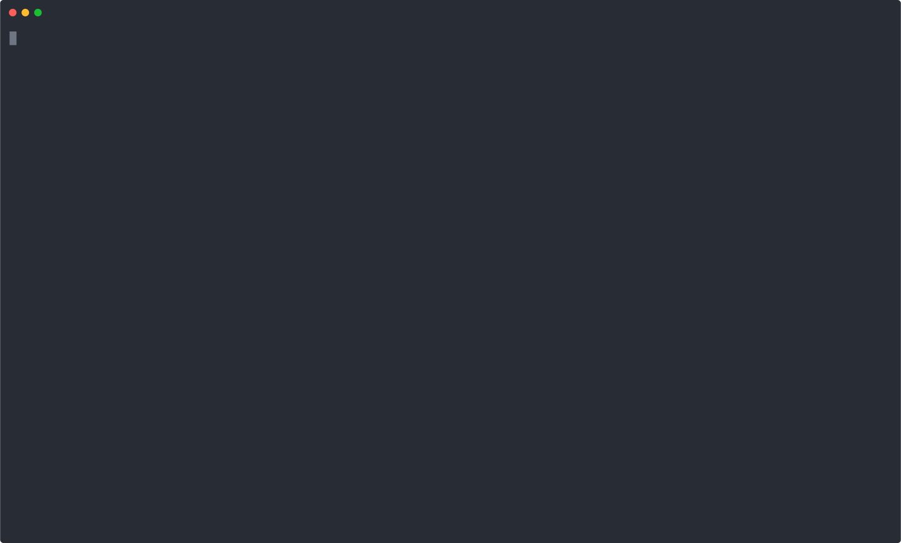

# Templ8

Templ8 is a templating tool, that reduces time spent copy and pasting away multiple elements.

## This product is a work in progress !
This project is still in its early stages, expect a lot of things breaking, or corner cases not covered.

Here is a non-exhaustive list of things to fix:
- [ ] Add support for arrays (#11)
- [ ] Add better error logging if possible (#17)